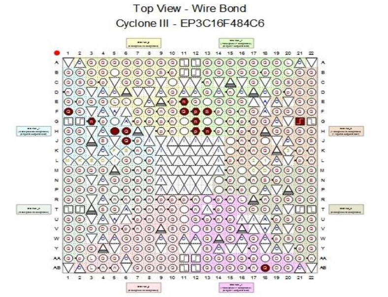
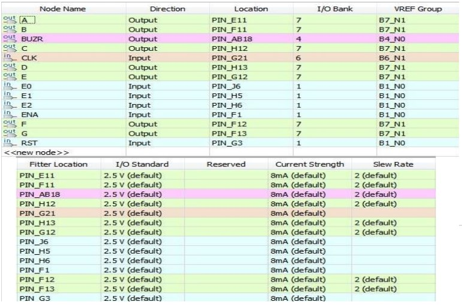

# Musical-Notes-Digital-Circuit-MNDC-
Circuito em VHDL que faz emitir sons em 8 frequências diferentes, de acordo com o posicionamento das chaves da placa FPGA.

### Funcionamento do circuito

O circuito é executado a partir do pressionamento do botão PIN_F1, enquanto o botão é selecionado, pode-se mudar o valor da frequência de acordo com as posições das chaves de seleção (3 chaves, podendo ter valores de frequência de 0 até 7), ao serem trocados os valores de frequência pelas chaves, é mostrado no display de sete segmentos a nota selecionada, de acordo com a ordem de cada uma. 
O valor de frequência é determinado de acordo com as chaves, com um switch que pega o valor da chave, em binário (de 000 até 111) e seleciona um valor para o fator, esse valor já foi pré-calculado, utilizando a frequência original da placa FPGA Cyclone III EP3C16F484C6 da Altera (50 MHz) e as frequências de cada nota, esse cálculo é explicado a seguir.

### Cálculo da frequência de saída

Para produzir as frequências das notas musicais, o circuito faz a contagem dos pulsos de clock, até que atinja os valores fixos pré-determinados, os quais são passados para o "FATOR". 
Esse fator é utilizado para dividir a frequência original da placa até que a frequência de saída seja a da nota desejada. A fórmula de cálculo do fator é dada abaixo:
FATOR =  (Frequência da placa) / 2 * (Frequência desejada na saída do buzzer)
A frequência da placa deve ser dividida por 2 porque a função  rising_edge conta período de subida do sinal lógico do clock, de 0 para 1 e o período de descida do sinal lógico do clock, de 1 para 0.

### Funcionamento da saída do som

Ao ser selecionado uma frequência pelo switch das chaves, essa frequência é passada para os pinos onde o buzzer está conectado, ao surgir uma frequência diferente de zero no buzzer é criado um campo elétrico em seu interior, já que esse possui um material piezoelétrico que vibra, com essa vibração os cristais que estão nesse material no interior do buzzer entra em ressonância com a frequência dos pinos das placa, gerando um som de alguma frequência de notas musicais selecionadas.

### Pinagem para a FPGA

A pinagem, no “Pin Planner” do Quartus, feita para implementar o circuito na placa FPGA encontram-se nas figuras abaixo.

